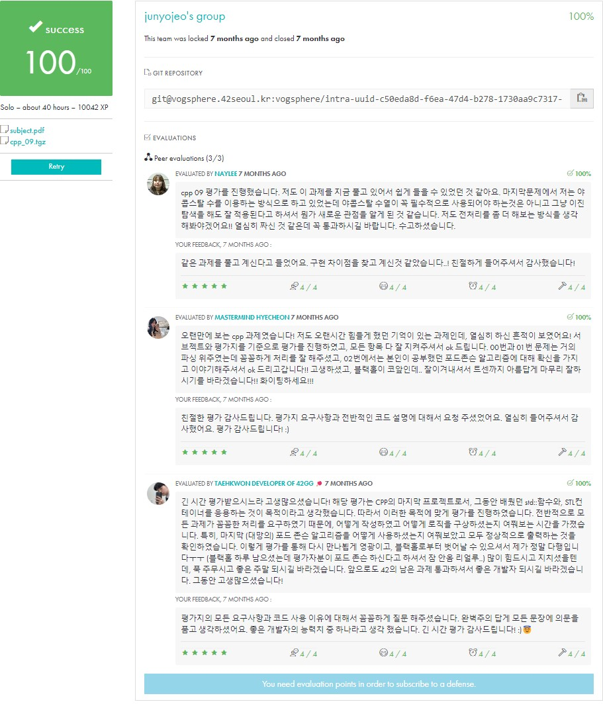

<div align="center">
  <h1>💻 CPP Module 09</h1>
  <p>STL 컨테이너 | 금융 데이터 처리</p>

  
  
  <div>
    
    
  </div>

  ### 학습 내용
  - STL 컨테이너 심화 활용
  - 데이터 구조와 알고리즘
  - 파일 입출력 처리
  - 시간 복잡도 최적화
  - 예외 처리 패턴
</div>

## 🚀 Quick Start
```bash
make && ./btc
```

## 📋 목차
1. [개요](#-개요)
2. [구현 요구사항](#-구현-요구사항)
3. [STL 활용](#-stl-활용)
4. [테스트 방법](#-테스트-방법)
5. [주의사항](#-주의사항)
6. [평가 준비](#-평가-준비)

## 🎯 개요
> STL을 활용한 실전 데이터 처리 프로젝트입니다.

### 프로젝트 구조
```
📦 CPP-Module-09
 ├── 📜 ex00/
 │   ├── BitcoinExchange.{hpp,cpp} # Bitcoin 가격 데이터베이스
 │   └── main.cpp
 ├── 📜 ex01/
 │   ├── RPN.{hpp,cpp}            # 역폴란드 표기법 계산기
 │   └── main.cpp
 └── 📜 ex02/
     ├── PmergeMe.{hpp,cpp}       # 병합-삽입 정렬
     └── main.cpp
```

### Key Features
- 파일 입출력을 통한 데이터 처리
- 맵(map) 컨테이너를 이용한 데이터베이스 구현
- 스택을 활용한 수식 계산
- 정렬 알고리즘 구현과 성능 분석

## 💡 구현 요구사항
> 각 exercise별 세부 구현 요구사항입니다.

### ex00: Bitcoin Exchange
```cpp
class BitcoinExchange {
private:
    std::map<std::string, float> _database;  // 날짜별 환율 데이터

public:
    // Orthodox Canonical Form
    BitcoinExchange();
    BitcoinExchange(const BitcoinExchange& other);
    ~BitcoinExchange();
    BitcoinExchange& operator=(const BitcoinExchange& other);

    // Core functions
    void loadDatabase(const std::string& filename);
    float getExchangeRate(const std::string& date) const;
    void processInputFile(const std::string& filename);
    
    // Error handling
    class InvalidDateException : public std::exception;
    class InvalidValueException : public std::exception;
    class FileErrorException : public std::exception;
};
```

### ex01: RPN (Reverse Polish Notation)
```cpp
class RPN {
private:
    std::stack<int> _numbers;  // 숫자 스택

public:
    // Core functions
    int calculate(const std::string& expression);
    void processOperation(char op);
    
    // Utility functions
    bool isOperator(char c) const;
    bool isNumber(char c) const;
    
    // Error handling
    class InvalidExpressionException : public std::exception;
    class DivisionByZeroException : public std::exception;
};
```

### ex02: PmergeMe
```cpp
template <typename Container>
class PmergeMe {
private:
    Container _data;
    size_t _threshold;  // 삽입 정렬로 전환할 임계값

public:
    // Sorting functions
    void sort();
    void mergeInsertSort(typename Container::iterator begin,
                        typename Container::iterator end);
    
    // Performance measurement
    double getBenchmark() const;
    void displayStats() const;
    
    // Utility functions
    void loadNumbers(int argc, char* argv[]);
    void displayContainer() const;
};

// 두 가지 컨테이너 구현 필요
template class PmergeMe<std::vector<int>>;
template class PmergeMe<std::list<int>>;
```

### 구현 시 주의사항
1. 파일 입출력
```cpp
// 파일 열기 에러 처리
std::ifstream file(filename);
if (!file.is_open()) {
    throw FileErrorException();
}

// CSV 파싱
std::string line;
while (std::getline(file, line)) {
    // 데이터 파싱 및 유효성 검사
}
```

2. 날짜 처리
```cpp
// 날짜 형식 검증 (YYYY-MM-DD)
bool isValidDate(const std::string& date) {
    // 정규식 또는 문자열 파싱으로 구현
    // 윤년 처리 포함
}
```

3. 성능 측정
```cpp
// 실행 시간 측정
clock_t start = clock();
// 정렬 수행
clock_t end = clock();
double time = static_cast<double>(end - start) / CLOCKS_PER_SEC;
```

## 🔄 STL 활용
> 각 exercise에서 활용하는 STL 컴포넌트들을 설명합니다.

### 1. Map 컨테이너 (BitcoinExchange)
```cpp
// 데이터베이스 구현
std::map<std::string, float> _database;

// 가장 가까운 날짜의 환율 찾기
float getExchangeRate(const std::string& date) const {
    auto it = _database.lower_bound(date);
    if (it == _database.begin()) {
        throw InvalidDateException();
    }
    --it;  // 이전 날짜의 환율 사용
    return it->second;
}

// 데이터 삽입
_database.insert(std::make_pair(date, rate));
```

### 2. Stack 컨테이너 (RPN)
```cpp
// RPN 계산기 구현
std::stack<int> _numbers;

void processOperation(char op) {
    if (_numbers.size() < 2)
        throw InvalidExpressionException();
        
    int b = _numbers.top(); _numbers.pop();
    int a = _numbers.top(); _numbers.pop();
    
    switch (op) {
        case '+': _numbers.push(a + b); break;
        case '-': _numbers.push(a - b); break;
        case '*': _numbers.push(a * b); break;
        case '/': 
            if (b == 0) throw DivisionByZeroException();
            _numbers.push(a / b); 
            break;
    }
}
```

### 3. Vector와 List (PmergeMe)
```cpp
// 벡터 구현
template <>
void PmergeMe<std::vector<int>>::mergeInsertSort(
    std::vector<int>::iterator begin,
    std::vector<int>::iterator end) {
    
    if (std::distance(begin, end) <= _threshold) {
        // 삽입 정렬
        for (auto it = begin + 1; it != end; ++it) {
            auto key = *it;
            auto jt = it - 1;
            while (jt >= begin && *jt > key) {
                *(jt + 1) = *jt;
                --jt;
            }
            *(jt + 1) = key;
        }
    } else {
        // 병합 정렬
        auto mid = begin + std::distance(begin, end) / 2;
        mergeInsertSort(begin, mid);
        mergeInsertSort(mid, end);
        std::inplace_merge(begin, mid, end);
    }
}

// 리스트 구현
template <>
void PmergeMe<std::list<int>>::mergeInsertSort(
    std::list<int>::iterator begin,
    std::list<int>::iterator end) {
    
    if (std::distance(begin, end) <= _threshold) {
        // 리스트용 삽입 정렬
        for (auto it = std::next(begin); it != end; ++it) {
            auto key = *it;
            auto jt = it;
            while (jt != begin && *std::prev(jt) > key) {
                *jt = *std::prev(jt);
                --jt;
            }
            *jt = key;
        }
    } else {
        // 리스트용 병합 정렬
        auto mid = std::next(begin, std::distance(begin, end) / 2);
        mergeInsertSort(begin, mid);
        mergeInsertSort(mid, end);
        std::list<int> temp;
        std::merge(begin, mid, mid, end, 
                  std::back_inserter(temp));
        std::copy(temp.begin(), temp.end(), begin);
    }
}
```

## 🔍 테스트 방법
> 각 exercise별 테스트를 수행합니다.

### ex00: Bitcoin Exchange
```bash
# 정상 케이스
$ cat input.txt
2011-01-03 | 3
2011-01-03 | 2.5
2011-01-03 | 2
2011-01-09 | 1

$ ./btc input.txt
2011-01-03 => 3 = 0.9
2011-01-03 => 2.5 = 0.75
2011-01-03 => 2 = 0.6
2011-01-09 => 1 = 0.32

# 에러 케이스
$ cat error.txt
2011-01-03 | -1
2011-13-03 | 2
2011-01-03 | 2147483648

$ ./btc error.txt
Error: not a positive number.
Error: bad input => 2011-13-03
Error: too large a number.
```

### ex01: RPN Calculator
```bash
# 기본 연산
$ ./RPN "8 9 * 9 - 9 - 9 - 4 - 1 +"
42

# 에러 케이스
$ ./RPN "1 2 3 +"
Error: Invalid expression

$ ./RPN "1 0 /"
Error: Division by zero
```

### ex02: PmergeMe
```bash
# 정렬 및 성능 측정
$ ./PmergeMe 3 5 9 7 4
Before: 3 5 9 7 4
After:  3 4 5 7 9
Time to process a range of 5 elements with std::vector : 0.00031 us
Time to process a range of 5 elements with std::list : 0.00047 us

# 대량 데이터 테스트
$ ./PmergeMe `shuf -i 1-100000 -n 3000 | tr "\n" " "`
Before: ...
After: ...
Time to process a range of 3000 elements with std::vector : 62.14 us
Time to process a range of 3000 elements with std::list : 94.53 us
```

### 성능 테스트 스크립트
```bash
#!/bin/bash
# test.sh

# 다양한 크기의 입력에 대한 테스트
for size in 5 10 100 1000 10000; do
    echo "Testing with $size elements..."
    numbers=$(shuf -i 1-100000 -n $size | tr "\n" " ")
    ./PmergeMe $numbers
    echo "----------------------------------------"
done
```

### 메모리 누수 테스트
```bash
# valgrind로 메모리 누수 체크
valgrind --leak-check=full ./btc input.txt
valgrind --leak-check=full ./RPN "1 2 +"
valgrind --leak-check=full ./PmergeMe 3 5 9 7 4
```

## ⚠️ 주의사항
> 구현 시 반드시 확인해야 할 사항들입니다.

### 1. 파일 입출력 처리
```cpp
// ❌ 잘못된 구현
void loadDatabase(const std::string& filename) {
    std::ifstream file(filename);
    std::string line;
    while (std::getline(file, line)) {  // 파일 열기 실패 체크 없음
        // 처리
    }
}

// ✅ 올바른 구현
void loadDatabase(const std::string& filename) {
    std::ifstream file(filename);
    if (!file.is_open()) {
        throw FileErrorException();
    }
    std::string line;
    while (std::getline(file, line)) {
        try {
            // 데이터 파싱 및 검증
        } catch (const std::exception& e) {
            file.close();  // 파일 핸들러 정리
            throw;
        }
    }
    file.close();
}
```

### 2. 데이터 유효성 검사
```cpp
// Bitcoin Exchange
bool isValidDate(const std::string& date) {
    // YYYY-MM-DD 형식 검사
    if (date.length() != 10 || date[4] != '-' || date[7] != '-')
        return false;
        
    int year = std::atoi(date.substr(0, 4).c_str());
    int month = std::atoi(date.substr(5, 2).c_str());
    int day = std::atoi(date.substr(8, 2).c_str());
    
    // 윤년 처리 포함한 날짜 유효성 검사
    return checkDate(year, month, day);
}

// RPN Calculator
bool isValidExpression(const std::string& expr) {
    int numbers = 0, operators = 0;
    
    std::istringstream iss(expr);
    std::string token;
    while (iss >> token) {
        if (isNumber(token))
            numbers++;
        else if (isOperator(token))
            operators++;
        else
            return false;
    }
    
    return numbers == operators + 1;
}
```

### 3. 성능 최적화
```cpp
// PmergeMe
template <typename Container>
void PmergeMe<Container>::sort() {
    // 최적의 임계값 설정
    _threshold = (std::distance(_data.begin(), _data.end()) <= 16) ? 
                 std::distance(_data.begin(), _data.end()) : 16;
                 
    // 불필요한 복사 방지
    mergeInsertSort(_data.begin(), _data.end());
}

// 컨테이너 선택
void processLargeDataset() {
    // vector: 임의 접근이 필요한 경우
    std::vector<int> vec;  // O(1) 임의 접근
    
    // list: 잦은 삽입/삭제가 필요한 경우
    std::list<int> lst;    // O(1) 삽입/삭제
}
```

### 4. 예외 안전성
```cpp
// 강력한 예외 보장
class BitcoinExchange {
private:
    std::map<std::string, float> _database;
    
public:
    void addData(const std::string& date, float value) {
        // 임시 객체를 사용한 안전한 수정
        std::map<std::string, float> temp = _database;
        temp.insert(std::make_pair(date, value));
        _database.swap(temp);  // 실패하면 원본 보존
    }
};
```

## ✅ 평가 준비
> 평가 시 확인하는 핵심 사항들입니다.

### 1. 기본 요구사항
| 항목 | 설명 | 확인 |
|-----|------|------|
| 컴파일 | C++ 98 표준 준수 | ⬜ |
| 메모리 | 누수 없음 | ⬜ |
| 예외 처리 | 모든 예외 상황 처리 | ⬜ |
| 성능 | 적절한 실행 시간 | ⬜ |

### 2. Exercise별 체크리스트

#### ex00: Bitcoin Exchange
- [ ] 데이터베이스 파일 처리
  ```cpp
  // data.csv 파일 읽기
  // 날짜,환율 형식 파싱
  ```
- [ ] 입력 파일 처리
  ```cpp
  // date | value 형식 검증
  // 적절한 에러 메시지 출력
  ```
- [ ] 예외 처리
  - 잘못된 날짜 형식
  - 음수 값
  - 너무 큰 수
  - 파일 오류

#### ex01: RPN Calculator
- [ ] 연산자 처리
  ```cpp
  // +, -, *, / 연산 지원
  // 스택을 이용한 계산
  ```
- [ ] 입력 검증
  - 올바른 RPN 형식
  - 숫자와 연산자 구분
- [ ] 예외 처리
  - 잘못된 식
  - 0으로 나누기

#### ex02: PmergeMe
- [ ] 두 가지 컨테이너 구현
  ```cpp
  // std::vector 구현
  // std::list 구현
  ```
- [ ] 정렬 알고리즘
  - 병합 정렬
  - 삽입 정렬
- [ ] 성능 측정
  - 실행 시간 출력
  - 컨테이너 간 비교

### 3. 평가 대비 질문
```cpp
// Q: STL 컨테이너 선택 기준은?
A: - map: 키-값 쌍의 정렬된 데이터 (Bitcoin Exchange)
   - stack: LIFO 연산이 필요한 경우 (RPN Calculator)
   - vector/list: 정렬 성능 비교 (PmergeMe)

// Q: 파일 입출력 예외 처리는?
A: - 파일 열기/닫기 확인
   - EOF 처리
   - 형식 검증
   - 리소스 정리

// Q: 정렬 알고리즘 선택 이유는?
A: - 병합-삽입 정렬의 장점
   - 임계값에 따른 전략 변경
   - 컨테이너별 최적화
```

## 📚 참고자료
> 프로젝트 구현에 도움이 되는 자료들입니다.

### STL 컨테이너와 알고리즘
- [C++ Reference](https://en.cppreference.com/w/)
  - [std::map](https://en.cppreference.com/w/cpp/container/map)
  - [std::stack](https://en.cppreference.com/w/cpp/container/stack)
  - [std::vector](https://en.cppreference.com/w/cpp/container/vector)
  - [std::list](https://en.cppreference.com/w/cpp/container/list)

### 알고리즘 구현
```cpp
// 병합-삽입 정렬 (Ford-Johnson Algorithm)
template <typename Iterator>
void merge_insertion_sort(Iterator begin, Iterator end) {
    if (end - begin > THRESHOLD) {
        Iterator middle = begin + (end - begin) / 2;
        merge_insertion_sort(begin, middle);
        merge_insertion_sort(middle, end);
        std::inplace_merge(begin, middle, end);
    } else {
        insertion_sort(begin, end);
    }
}
```

### 파일 입출력
```cpp
// CSV 파일 파싱
std::string parseCsvLine(const std::string& line) {
    std::istringstream ss(line);
    std::string token;
    std::vector<std::string> tokens;
    
    while (std::getline(ss, token, ',')) {
        tokens.push_back(token);
    }
    return tokens;
}
```

### 성능 측정 도구
```cpp
// 실행 시간 측정 클래스
class Timer {
private:
    clock_t start;
public:
    Timer() : start(clock()) {}
    double elapsed() {
        return static_cast<double>(clock() - start) / CLOCKS_PER_SEC;
    }
};
```

### 벤치마킹 도구
- [Quick Bench](https://quick-bench.com/)
  - STL 컨테이너 벤치마킹
- [Compiler Explorer](https://godbolt.org/)
  - 컴파일러 최적화 확인
  - 어셈블리 코드 분석

### 디버깅 팁
```bash
# GDB 사용법
gdb ./program
break main
run
next
print variable

# Valgrind 메모리 체크
valgrind --leak-check=full ./program
```